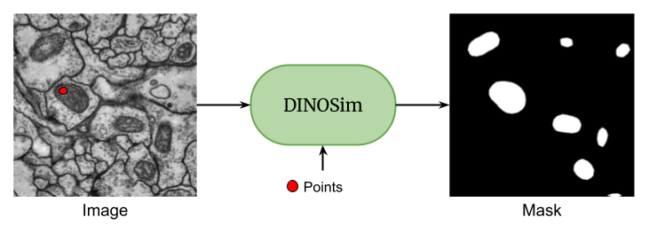

# DINOSim

[](https://github.com/AAitorG/napari-dinoSim/raw/main/LICENSE)
[](https://doi.org/10.1101/2025.03.09.642092)
[](https://pypi.org/project/napari-dinoSim)
[](https://python.org)
[](https://github.com/AAitorG/napari-dinoSim/actions)
[](https://codecov.io/gh/AAitorG/napari-dinoSim)
[](https://napari-hub.org/plugins/napari-dinosim)



A napari plugin for zero-shot image segmentation using DINO vision transformers.

----------------------------------

## Overview

`napari-dinoSim` allows users to perform zero-shot image segmentation by selecting reference points on an image. The plugin then computes similarity maps based on features extracted by DINOv2 and generates segmentation masks.

For detailed information on the widget's functionality, UI elements, and usage instructions, please refer to the [Plugin Documentation](./docs/plugin_documentation.md).

## Installation

You can install `napari-dinoSim` via [pip]. For GPU support (recommended), ensure you have a compatible PyTorch version installed with CUDA or MPS support.

```sh
pip install napari-dinosim
```

or from source via [conda]:

```bash
# Clone the repository
git clone https://github.com/AAitorG/napari-dinoSim.git
cd napari-dinoSim

# Create and activate the conda environment
conda env create -f environment.yml
conda activate napari-dinosim
```

## Open the Plugin

To launch napari, run the following command in your terminal:

```sh
napari
```

Within the napari interface, locate the `DINOSim segmentation` plugin in the Plugins section of the top bar.

## Contributing

Contributions are very welcome. Tests can be run with [tox], please ensure
the coverage at least stays the same before you submit a pull request.

## License

Distributed under the terms of the [MIT] license,
"napari-dinoSim" is free and open source software

## Citation

Please note that DINOSim is based on a [publication](https://doi.org/10.1101/2025.03.09.642092). If you use it successfully for your research, please be so kind to cite our work:

```bibtex
@article {Gonzalez-Marfil2025dinosim,
	title = {DINOSim: Zero-Shot Object Detection and Semantic Segmentation on Electron Microscopy Images},
	author = {Gonz{\'a}lez-Marfil, Aitor and G{\'o}mez-de-Mariscal, Estibaliz and Arganda-Carreras, Ignacio},
	journal = {bioRxiv}
	publisher = {Cold Spring Harbor Laboratory},
	url = {https://www.biorxiv.org/content/early/2025/03/13/2025.03.09.642092},
	doi = {10.1101/2025.03.09.642092},
	year = {2025},
}
```

## Issues

If you encounter any problems, please [file an issue] along with a detailed description.

[napari]: https://github.com/napari/napari
[MIT]: http://opensource.org/licenses/MIT
[tox]: https://tox.readthedocs.io/en/latest/
[pip]: https://pypi.org/project/pip/
[PyPI]: https://pypi.org/
[conda]: https://docs.conda.io/en/latest/miniconda.html
